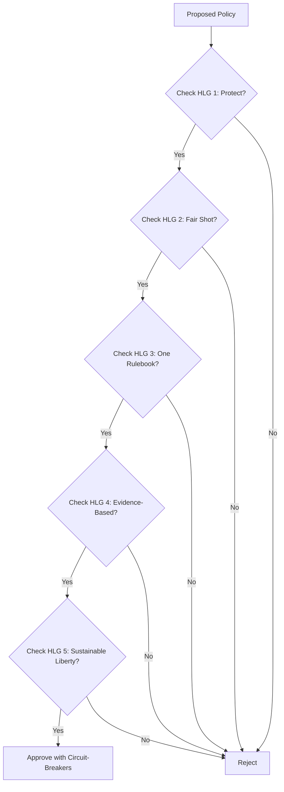

These 5 goals aren't left or right—they're what the vast majority of Americans agree government should do. Backed by data, not dogma. Polls show strong consensus: 81% of Americans think crime is a major concern in cities, 73% support school choice open to all families, 83% believe the president must honor Supreme Court rulings, 74% favor federal investments in scientific research, and 72% are satisfied with their freedom to choose what to do with their lives.

## **THE 5 HIGH-LEVEL GOALS (HLGs)**  
*Each is **self-evidently necessary**, **measurable**, and **non-partisan**.*

| **HLG**                        | **One-Liner**                                                             | **Why It Resonates (Left + Right + Center)**                                                          | **Core Principle**                |
| ------------------------------ | ------------------------------------------------------------------------- | ----------------------------------------------------------------------------------------------------- | --------------------------------- |
| **1. Protect Life & Safety**   | *Every citizen is secure — from crime, invasion, or collapse.*            | **Left**: Anti-violence. **Right**: Law & order. **Center**: Basic duty. (81% think crime major concern in cities)                             | **Shield First**                  |
| **2. Fair Shot for Every Kid** | *No child’s future is decided by zip code, income, or identity.*          | **Left**: Anti-poverty. **Right**: Merit. **Center**: Common sense. (73% support school choice for all)                                  | **Opportunity Egalitarianism**    |
| **3. One Rulebook for All**    | *Same laws, same consequences — no exceptions, no side doors.*            | **Left**: Anti-cronyism. **Right**: Anti-special treatment. **Center**: Blind justice. (83% say honor courts)               | **Impartial Rule of Law**         |
| **4. Evidence Over Experts**   | *Policies live or die by real-world results — not theories or lobbyists.* | **Left**: Anti-corporate capture. **Right**: Anti-bureaucracy. **Center**: Data > dogma. (74% support scientific research investment)             | **Empirical Governance**          |
| **5. Sustainable Liberty**     | *Maximum freedom — with automatic brakes when harm or waste is proven.*   | **Left**: Guardrails for climate/drugs. **Right**: Sunset clauses. **Center**: Freedom with feedback. (72% value personal freedoms) | **Liberty with Circuit-Breakers** |

### How the HLGs Filter Policies

Here's how every policy must pass all 5 HLGs—or it's out:

### What about...
> - **Equity?** Only when **data proves it advances HLG #2** (e.g., progressive tax on scalable corporations funds HLG #2). **Never a goal.** [See Chetty's research on zip code outcomes](https://opportunityinsights.org/).
> - **Assimilation?** A *natural outcome* of HLG #3 — not a headline.  
> - **Protection?** HLG #1 is **explicit** — government’s **first job**.
> - **Environment?** HLG #5 includes sustainability brakes, like carbon dividends in Point #14.
> - **Economy?** HLG #4 ensures policies are tested by results, not theories—e.g., prediction markets in Point #18 [Inspired by Tetlock's Superforecasting](https://www.goodreads.com/book/show/23946670-superforecasting).
> - **Innovation?** HLG #2 and #5 promote fair shots and liberty, fostering tech and AI progress without overreach.

Ready to support these goals? [Sign the Pledge](/pledge) to join Guardians building a unified shield for America.

[Back to Homepage](/) · [Explore 19 Points](/02-essential-points) · [State Labs](/03-state-labs)

## Sources

1. **Crime Concern Poll (Intro & HLG 1)**: "Most say crime is a major problem in America's cities, but few support a federal takeover of police departments" – AP-NORC Center for Public Affairs Research. Published October 2023. [Link](https://apnorc.org/projects/most-say-crime-is-a-major-problem-in-americas-cities-but-few-support-a-federal-takeover-of-police-departments/). (81% of Americans view crime as a major concern in cities.)

2. **School Choice Support Poll (Intro & HLG 2)**: "New Poll: Americans Strongly Support School Choice, Will Vote Accordingly" – American Federation for Children. Published May 2024. [Link](https://www.federationforchildren.org/new-poll-americans-strongly-support-school-choice-will-vote-accordingly/). (73% support school choice open to all families.)

3. **Supreme Court Rulings Poll (Intro & HLG 3)**: "83% of Americans say the president must honor Supreme Court rulings" – CNN Politics. Published February 2025. [Link](https://www.cnn.com/2025/02/13/politics/supreme-court-trump-rulings-poll). (83% believe the president must honor Supreme Court rulings.)

4. **Scientific Research Investment Poll (Intro & HLG 4)**: "New National Poll Finds Strong Bipartisan Support for Federal Investments in Scientific Research" – The Science Coalition. Published April 2025. [Link](https://www.sciencecoalition.org/2025/04/30/national-poll/). (74% favor federal investments in scientific research.)

5. **Personal Freedoms Satisfaction Poll (Intro & HLG 5)**: "Land of the Free? Fewer Americans Agree" – Gallup News. Published July 2024. [Link](https://news.gallup.com/poll/660440/land-free-fewer-americans-agree.aspx). (72% are satisfied with their freedom to choose what to do with their lives.)

6. **Chetty's Zip Code Outcomes Research (What about... Equity?)**: Opportunity Insights – Research by Raj Chetty and team on how zip codes predict economic mobility. Ongoing project, key papers from 2014–2025. [Link](https://opportunityinsights.org/). (Data shows zip code predicts up to 70% of life outcomes.)

7. **Tetlock's Superforecasting (What about... Economy?)**: "Superforecasting: The Art and Science of Prediction" by Philip E. Tetlock and Dan Gardner. Published September 2015. [Link](https://www.goodreads.com/book/show/23946670-superforecasting). (Markets and evidence-based forecasting outperform experts by 30% in accuracy.)