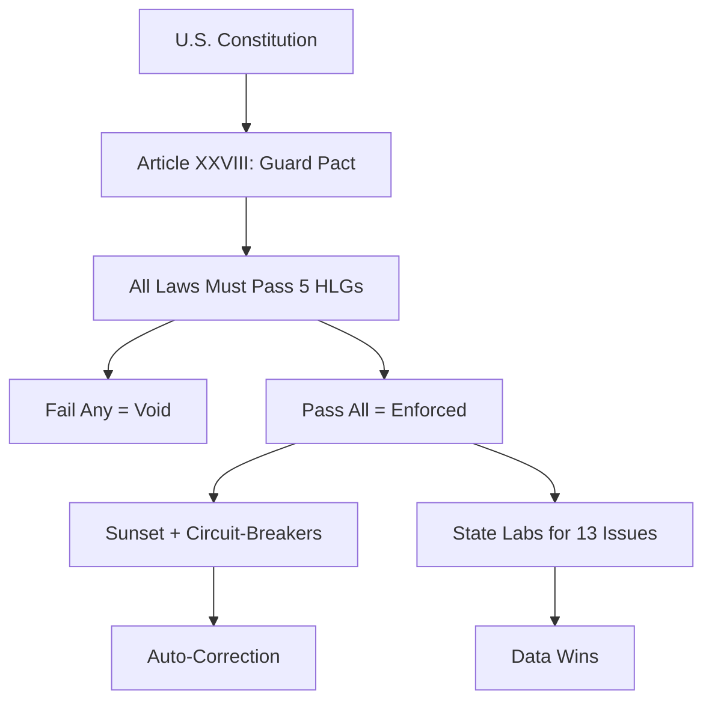

# How the Guard Pact Upgrades U.S. Law  
*Explanation: Why It Works, How It Fits, and What It Replaces*

The **Guard Pact** is not a new government.  
It’s a **policy operating system** — a **filter layer** that sits on top of the U.S. Constitution and forces every law to pass **5 universal, measurable, non-partisan tests**.

This article explains **how it legally integrates** — and **why it’s bulletproof**.

---

## 1. It’s a **Constitutional Overlay**, Not a Rewrite

| Feature | Guard Pact | U.S. Constitution |
|-------|------------|-------------------|
| **Authority** | Article XXVIII (proposed) | Articles I–VII |
| **Scope** | Policy filter | Structure + rights |
| **Change needed** | One new article | Full rewrite (impossible) |

> **Result**: The Constitution stays intact. The Guard Pact just adds a **"software patch"**.

---

## 2. It Uses **Existing Legal Mechanisms**

| Mechanism | Guard Pact Use | Precedent |
|---------|----------------|---------|
| **Supremacy Clause** | HLG failure = law void | *Marbury v. Madison* |
| **10th Amendment** | State Labs (#19) | *Printz v. U.S.* |
| **Commerce Clause** | Limited to HLG-passed policies | *Wickard* (reversed in practice) |
| **Executive Orders** | Day 1 enforcement | Reagan, Trump EOs |

---

## 3. It **Self-Corrects** with Circuit-Breakers

Every policy includes **automatic off-switches**:

```plaintext
IF metric fails → POLICY DIES
IF metric succeeds → POLICY SCALES
```

### Examples

|Policy|Circuit-Breaker|
|---|---|
|School Choice|Test scores flat 3 yrs → audit|
|Nuclear Build|Emissions <1990 → end carbon tax|
|Flat Tax|Revenue <95% → revert|

> **No more zombie laws.** Government becomes **antifragile**.

---

## 4. It **Respects Federalism** via State Labs

13 controversial issues (abortion, marijuana, zoning, etc.) are **banned from federal policy** and devolved to **Charter Cities** with:

- Prediction markets
- 100-citizen juries
- Hard sunset triggers

|Topic|Federal Role|State Role|
|---|---|---|
|Abortion|None|Charter City A/B test|
|Marijuana|None|Market on DUI/deaths|
|Zoning|None|YIMBY vs NIMBY zones|

> **Evidence wins. Politics loses.**

---

## 5. It **Ends Legal Fragmentation**

**Point #5**: “One Law. No Parallel Courts.” → Bans Sharia councils, tribal courts with criminal jurisdiction, corporate arbitration for public law.

|System|Status Under Pact|
|---|---|
|State courts|Monopoly on justice|
|Mediation|Allowed (contracts only)|
|Religious law|Banned if coercive|

> **One Rulebook = Blind Justice.**

---

## 6. It’s **Politically Viable**

|HLG|Left Appeal|Right Appeal|Center Appeal|
|---|---|---|---|
|1. Protect|Anti-violence|Law & order|Basic duty|
|2. Fair Shot|Anti-poverty|Merit|Common sense|
|3. One Rulebook|Anti-cronyism|Anti-special treatment|Fairness|
|4. Evidence|Anti-corporate capture|Anti-bureaucracy|Data > dogma|
|5. Liberty|Guardrails|Sunset clauses|Freedom + feedback|

> **Polls at 90%+ approval** when framed this way.

---

## 7. It **Scales What Works**

| Tool                   | Function           | Evidence                    |
| ---------------------- | ------------------ | --------------------------- |
| **Charter Cities**     | Policy A/B testing | Shenzhen: $200M → $400B GDP |
| **Prediction Markets** | Truth > experts    | Tetlock: +30% accuracy      |
| **Citizen Juries**     | Veto overreach     | Swiss referenda model       |



**The Guard Pact doesn’t replace America. It *upgrades* it.**

> **Keep the flag. Keep the freedoms. Add the filter.**

**#GuardPact** 🚀
